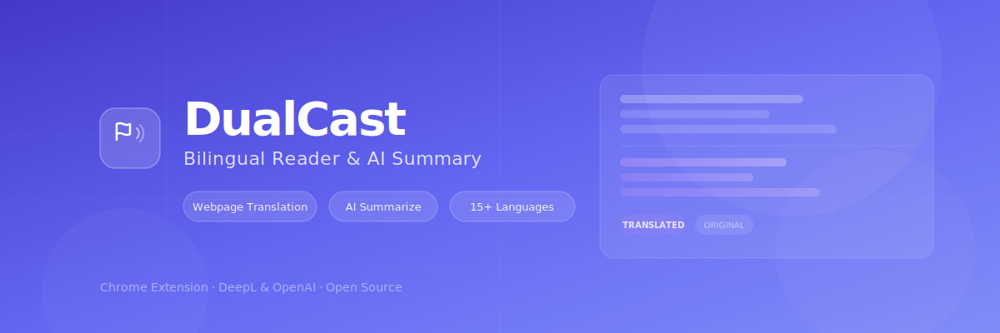
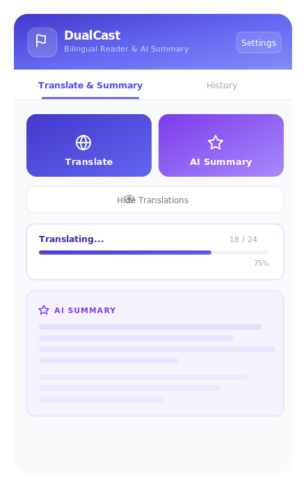
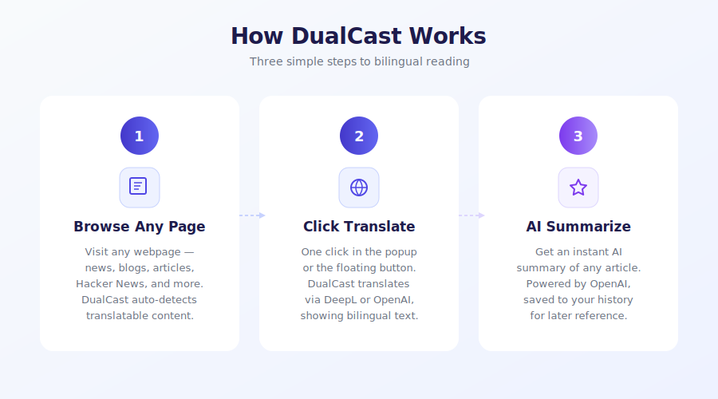

<p align="center">
  
</p>

<p align="center">
  <strong>Translate any webpage into a bilingual view. Summarize articles with AI. All in one click.</strong>
</p>

<p align="center">
  <a href="#installation"></a>
  
  
  
  
</p>


---

## What is DualCast?

**DualCast** is a Chrome extension that lets you read any webpage in two languages, side by side. It also provides instant AI-powered article summaries — all without leaving the page.

Whether you're reading Hacker News, tech blogs, research papers, or news sites, DualCast puts translations right next to the original text so you never lose context.

<p align="center">
  
</p>
---

## Features

### Bilingual Page Translation

- **One-click translate** — translate the entire page with a single button
- **Inline bilingual view** — translations appear right below the original text
- **15+ languages** — Chinese, English, Japanese, Korean, German, French, Spanish, and more
- **Auto-detect source language** — no need to manually select
- **Toggle visibility** — show/hide translations without losing them
- **Smart caching** — translated text is cached to save API calls

### AI Article Summary

- **Instant summaries** — get the key points of any article in seconds
- **Powered by OpenAI** — uses GPT-5.2 for fast, accurate summaries
- **Summary history** — all summaries are saved and searchable
- **Works on any article** — blogs, news, documentation, research papers

### Hacker News Enhanced

- **Auto-detect HN pages** — special support for news.ycombinator.com
- **Translate titles, comments, and post bodies** independently
- **Floating translate button** on article pages

### Universal Compatibility

- **Works on any website** — not limited to specific domains
- **Smart article detection** — uses Mozilla Readability to find article content
- **Floating action button** — appears on pages with detectable articles
- **Preserves formatting** — translations maintain the original page layout

---

## How It Works

<p align="center">
  
</p>
---

## Installation

### From Source (Developer)

**Prerequisites**: [Bun](https://bun.sh) (or Node.js + npm)

```bash
# Clone the repository
git clone https://github.com/your-username/dualcast.git
cd dualcast

# Install dependencies
bun install

# Start development mode
bun run dev
```

### Load into Chrome

1. Open `chrome://extensions/`
2. Enable **Developer mode** (top-right toggle)
3. Click **Load unpacked**
4. Select the `build/chrome-mv3-dev` directory

### Build for Production

```bash
bun run build      # Build to build/chrome-mv3-prod
bun run package    # Package for distribution
```

---

## Setup

### Step 1: Choose a Translation Provider


| Provider                | Best For                                                              | Pricing                                                      |
| ----------------------- | --------------------------------------------------------------------- | ------------------------------------------------------------ |
| **DeepL** (Recommended) | High-quality translation, especially for European and Asian languages | [Free tier: 500K chars/month](https://www.deepl.com/pro-api) |
| **OpenAI**              | Flexible, supports custom models and endpoints                        | [Pay-as-you-go](https://platform.openai.com/api-keys)        |


### Step 2: Enter Your API Key

1. Click the DualCast icon in your browser toolbar
2. Click **Settings**
3. Select your provider and paste your API key
4. Choose your target language
5. Click **Save Settings**

### Optional: AI Summary

If you use DeepL for translation, you can add a separate OpenAI key just for AI summaries. If you use OpenAI for translation, the same key is used for summaries too.

### Optional: Custom Endpoint

DualCast supports any OpenAI-compatible API. Enter a custom base URL and model name to use services like Azure OpenAI, Ollama, or other providers.

---

## Architecture

```
DualCast Extension
├── popup.tsx                        # Settings & controls UI
├── background/index.ts              # Service worker — API calls, caching, batching
├── contents/
│   ├── hn-enhancer.tsx              # Hacker News content script
│   └── universal-translator.tsx     # Universal article translator
├── assets/
│   ├── icon.png                     # Extension icon
│   ├── banner.svg                   # README banner
│   ├── popup-preview.svg            # Popup UI preview
│   └── how-it-works.svg            # Feature illustration
└── package.json
```

### Message Flow

```
User clicks "Translate"
    → popup.tsx sends TRANSLATE_PAGE to content script
    → content script walks DOM, extracts text
    → sends TRANSLATE messages to background/index.ts
    → background batches requests (20 texts, 100ms delay)
    → calls DeepL/OpenAI API
    → returns translations
    → content script inserts bilingual elements
```

### Key Design Decisions

- **Batch translation** — up to 20 texts per API request (DeepL) for efficiency
- **In-memory cache** — deduplicate translations within the same session
- **Content script isolation** — separate scripts for HN-specific and universal behavior
- **DOM marking** — `data-hn-dual-translated` attribute prevents re-translation
- **Readability detection** — Mozilla Readability identifies article content on any page

---

## Tech Stack


| Layer              | Technology                                                              |
| ------------------ | ----------------------------------------------------------------------- |
| Framework          | [Plasmo](https://docs.plasmo.com/) — modern browser extension framework |
| Language           | TypeScript + React                                                      |
| Translation        | DeepL API, OpenAI API (GPT-5.2)                                        |
| Article Extraction | [@mozilla/readability](https://github.com/nicola/readability)           |
| Package Manager    | [Bun](https://bun.sh)                                                   |


---

## Contributing

Contributions are welcome! Please feel free to submit issues and pull requests.

```bash
# Development workflow
bun install        # Install dependencies
bun run dev        # Start dev mode with hot reload
# Load build/chrome-mv3-dev as unpacked extension
```

---

## License

[Apache 2.0](LICENSE) — free to use, modify, and distribute with attribution.

---

<p align="center">
  <strong>DualCast</strong> — Read the web in your language.<br/>
  <sub>Built with Plasmo, React, DeepL & OpenAI</sub>
</p>